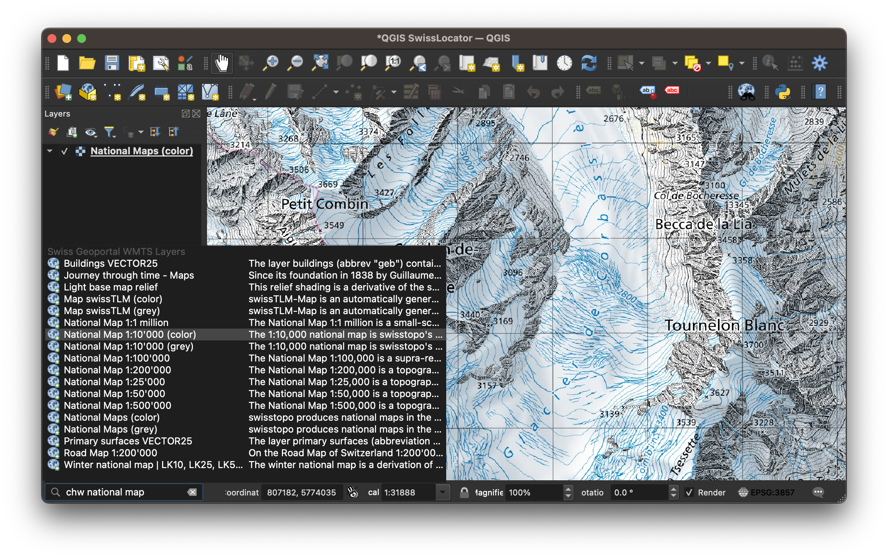
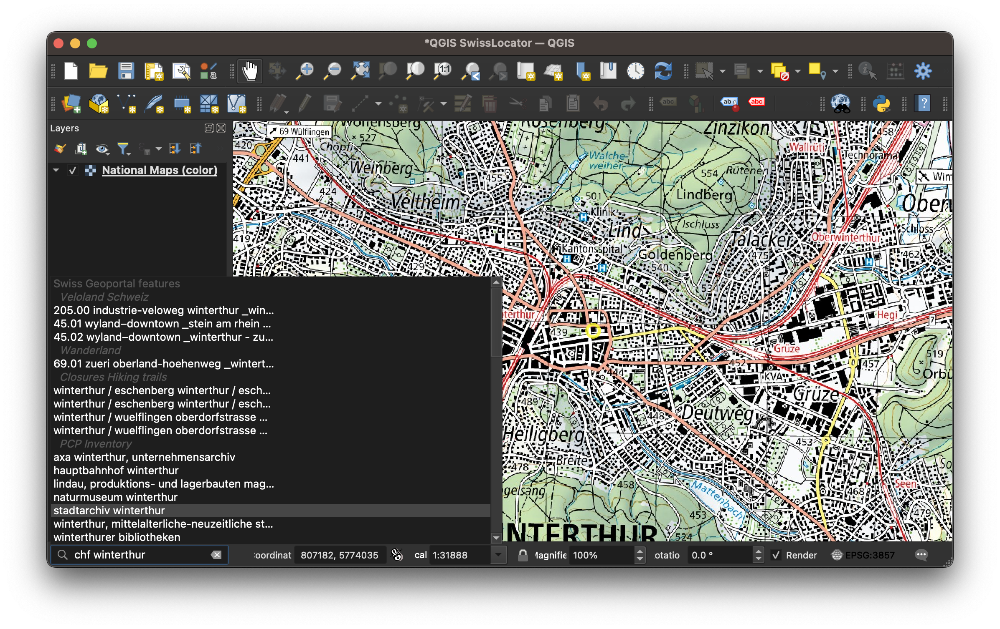
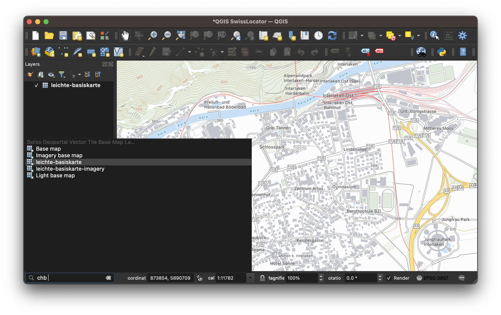
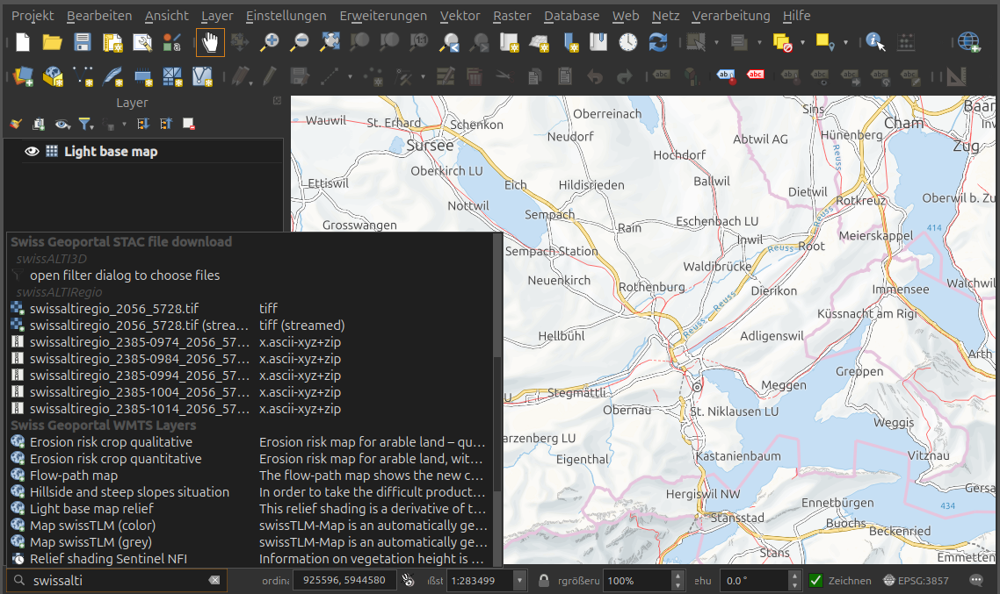
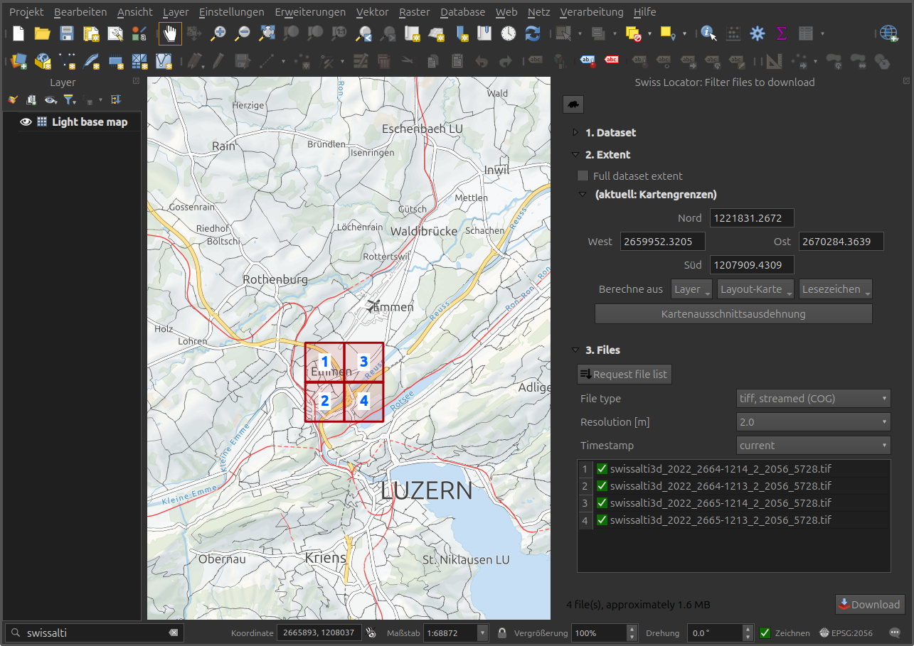
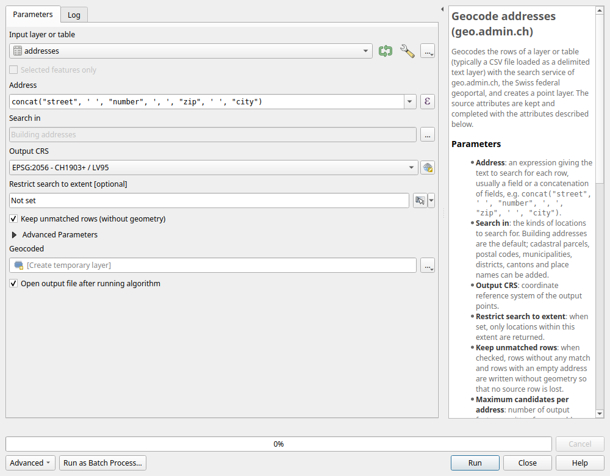

# QGIS Swiss Locator plugin

## What 
Integrates the Swiss Geoportal into QGIS

Similarly to the online geoportal [https://map.geo.admin.ch](https://map.geo.admin.ch/), this plugin allows to search within [QGIS](https://qgis.org/) desktop for

* Locations:
   * Cantons, cities and municipalities,
   * Place names as printed on the national map (SwissNames)
   * Districts
   * ZIP codes
   * Addresses
   * Cadastral parcels
* Layers from the Federal Geoportal (map.geo.admin.ch) or opendata.swiss, which can easily be added to the map
   * WMS
   * WMTS
   * Vector Tiles
* Features (search through features descriptions)
* Downloadable files from the Swisstopo STAC catalog

Elevation profiles can be displayed in QGIS and included in layouts. These profiles use the Elevation Profile service (swissALTI3D height model).

Tables of addresses (for instance a CSV file) can be geocoded in bulk into a point layer with the **Geocode addresses** Processing algorithm, see [Batch geocoding](#batch-geocoding).

## How

Type the text to search in the locator bar.

If the result is a **WMTS layer**, double-clicking on it will try to add it to the map. 
It might not be possible since some layers are only visible in the geoportal (map.geo.admin.ch).
In this case, a link will be shown to display the layer in the geoportal.

If the result is a **location** or **feature**, 
double-clicking on it will move the map canvas to the result and highlight its position.
If any further information can be shown, an info window will be shown over the map.

If the result is a **vector tiles layer**,
double clicking it will add it to the map canvas as another background layer.

If the result is a **file download** from the Swiss Geoportal STAC catalog,
double clicking it will download the file and add it to the map.

For topics with many files associated,
double clicking opens a filter dialog to further narrow down the search.
Users can do a spatial search, as well as filter file type, timestamp, raster
resolution, and more.

For displaying **elevation profiles**:
 1. Go to View -> Elevation Profiles -> New Elevation Profile.
2. Draw a line on the map using the `Capture Curve` tool from the Elevation Profile widget.
3. Optionally, you can change both the profile visibility and the rendering order in the Elevation Profile's Layer Tree.

### Batch geocoding

The plugin adds a **Swiss Locator** provider to the Processing toolbox with the algorithm
**Geocode addresses**. It geocodes every row of a layer or table and writes a point
layer that keeps the source attributes. It is built on the batch geocoding algorithm of QGIS.

1. Load the table of addresses, e.g. a CSV file through Layer -> Add Layer -> Add Delimited Text Layer
   with the geometry definition set to *No geometry*.
2. Open the Processing toolbox and run Swiss Locator -> Geocode addresses.
3. Set the **Address field**: the column holding the full address, such as
   `Seftigenstrasse 264, 3084 Wabern`. When the address is split over several columns, build it
   first with the field calculator, e.g. `concat("street", ' ', "number", ', ', "zip", ' ', "city")`.
4. Optionally restrict the search to an extent, choose the coordinate reference system (LV95 by
   default, LV03 otherwise; a layer with a geometry keeps its own CRS) or search other kinds of
   locations than building addresses (parcels, postal codes, municipalities...).

Each row gives one output feature, the best match when the service returns several locations. Rows
without any match are kept without geometry. The following attributes are added to the source
columns:

* `geocode_quality`: `exact` when every word of the address is found in the result, `fuzzy`
  otherwise. The search service is fuzzy and almost always returns a location, even for typos or
  unknown addresses, so check this attribute before trusting a result.
* `geocode_candidates`: number of locations returned by the service. More than one means the
  address is ambiguous.
* `geocode_label`, `geocode_detail`, `geocode_origin`, `geocode_feature_id` (EGID and EDID of the
  building), `geocode_rank` and `geocode_weight` as returned by the service.

The algorithm is also available from the model designer, the batch interface and `qgis_process`.

The geo.admin.ch services are free of charge but subject to a
[fair use policy](https://www.geo.admin.ch/en/general-terms-of-use-fsdi) of about 20 requests per
minute on average. Identical addresses are requested only once and a configurable pause is applied
between requests. Keep it for large tables and do not run unattended bulk jobs.

## More

The search is performed through the QGIS [locator bar](https://qgis.org/en/site/forusers/visualchangelog30/#feature-locator-bar).

Configuration is achieved in the main application settings under the `locator` tab. You will be able to:
* Enable or disable searches (locations, layers, features)
* Customize prefixes, define if they are default filters (used without prefix)
* Access to the configuration of the plugin
* Include or exclude opendata.swiss data from layer searches

In the configuration of the plugin, further customization can be achieved:
* Language definition (English, German, French, Italian, Rumantsch)
* CRS definition (project, CH1903 or CH1903+)
* Defining if the plugin will try to display further information in a tool tip
* Defining layers used in the feature search

## Who

This plugin has been developed by OPENGIS.ch with friendly support from
the [Swiss QGIS User Group](https://qgis.ch).
