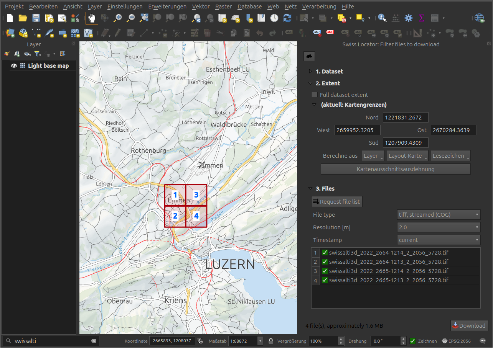

# QGIS Swiss Locator plugin

## What 
Integrates the Swiss Geoportal into QGIS

Similarly to the online geoportal [https://map.geo.admin.ch](https://map.geo.admin.ch/), this plugin allows to search within [QGIS](https://qgis.org/) desktop for

* Locations:
   * Cantons, cities and municipalities,
   * Place names as printed on the national map (SwissNames)
   * Districts
   * ZIP codes
   * Addresses
   * Cadastral parcels
* Layers from the Federal Geoportal (map.geo.admin.ch) or opendata.swiss, which can easily be added to the map
   * WMS
   * WMTS
   * Vector Tiles
* Features (search through features descriptions)
* Downloadable files from the Swisstopo STAC catalog

## How

Type the text to search in the locator bar.

If the result is a **WMTS layer**, double-clicking on it will try to add it to the map. 
It might not be possible since some layers are only visible in the geoportal (map.geo.admin.ch).
In this case, a link will be shown to display the layer in the geoportal.

If the result is a **location** or **feature**, 
double-clicking on it will move the map canvas to the result and highlight its position.
If any further information can be shown, an info window will be shown over the map.

If the result is a **vector tiles layer**,
double clicking it will add it to the map canvas as another background layer.

If the result is a **file download** from the Swiss Geoportal STAC catalog,
double clicking it will download the file and add it to the map.

For topics with many files associated,
double clicking opens a filter dialog to further narrow down the search.
Users can do a spatial search, as well as filter file type, timestamp, raster
resolution, and more.

## More

The search is performed through the QGIS [locator bar](https://qgis.org/en/site/forusers/visualchangelog30/#feature-locator-bar).

Configuration is achieved in the main application settings under the `locator` tab. You will be able to:
* Enable or disable searches (locations, layers, features)
* Customize prefixes, define if they are default filters (used without prefix)
* Access to the configuration of the plugin
* Include or exclude opendata.swiss data from layer searches

In the configuration of the plugin, further customization can be achieved:
* Language definition (English, German, French, Italian, Rumantsch)
* CRS definition (project, CH1903 or CH1903+)
* Defining if the plugin will try to display further information in a tool tip
* Defining layers used in the feature search

## Who

This plugin has been developed by OPENGIS.ch with friendly support from
the [Swiss QGIS User Group](https://qgis.ch).
